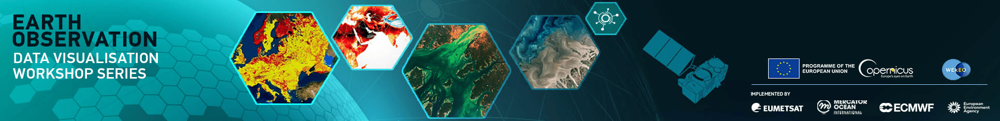

# Earth Observation Data Visualisation

</img>

Welcome to the Earth Observation Data Visualisation series. This repository will act as a place to collect examples of Earth observation data visualisation generated and/or shown throughout the webinars. It will continue to grow and evolve as the webinar series proceeds and will eventually also host the source material for our "best practice guide".

## Contents

This repository contains **both** the presentations provided throughout the webinar series and the best practice guide. The best practice guide is embedded as a *git submodule*, and so can be cloned separately if required.

* Presentations:
  * [Week 1: Introduction to EO Data Visualisation](presentations/week_01_Introduction_to_EO_Data_Visualisation)
  * [Week 2: Air Quality and Wildfires](presentations/week_02_Air_Quality_and_Wildfires)
  * [Week 3: Oceans and Sea Ice](presentations/week_03_Oceans_and_Sea_Ice)
  * [Week 4: Climate and Weather](presentations/week_04_Climate_and_Weather)
  * [Week 5: Climate Extremes: heatwaves, changes in ice and drought](presentations/week_05_Climate_Extremes)
  * [Week 6: Being Practical: How to access and process Copernicus and EUMETSAT data](presentations/week_06_Being_Practical)
* [Best practice guide](https://github.com/wekeo/eo-data-vis-best-practice-guide)

## Contacts

For questions, please contact [ops@eumetsat.int](ops@eumetsat.int)
